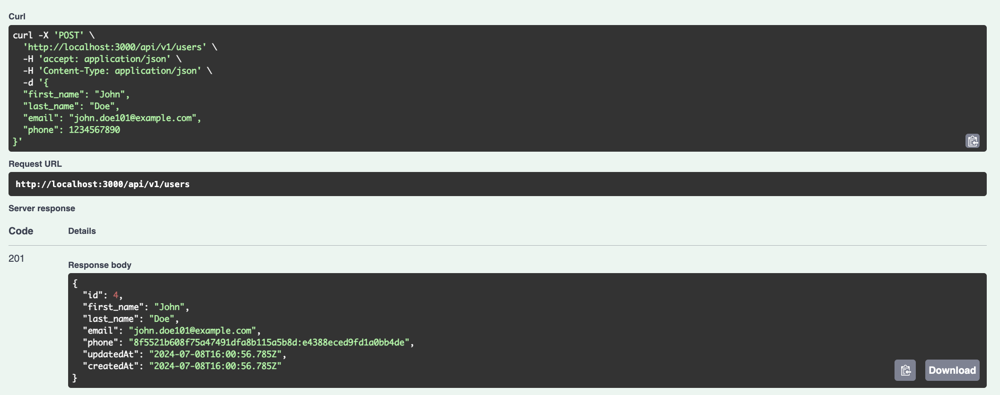
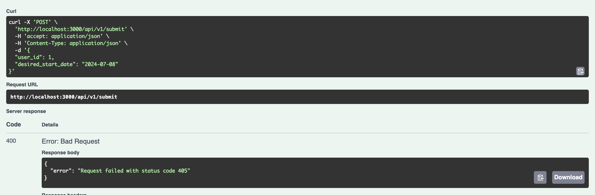
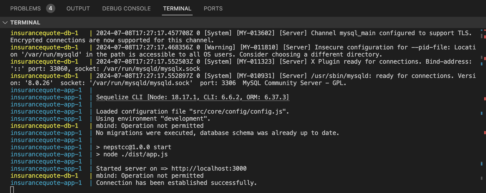

# Otto Insurance Quoting System

## Overview
This project is an Express.js application that utilizes MySQL with Sequelize ORM for database interactions. It includes features such as encryption/decryption of phone numbers (**_For assignment purpose I assume phone field is sensitive and we need to encrypt it before saving to database_**), validation on user creation, and Swagger documentation for API endpoints.

### Project Containerization:
The project has been containerized to ensure a consistent development and production environment. The Docker Compose setup includes a service for the Node.js application and a MySQL database.

### Database
MySQL Database:
This project uses MySQL as the database, managed through Sequelize ORM. Ensure the database connection details are correctly set in the .env file.
Due to ORM usage, any other database can be used by changing the configuration e.g. Postgres or Sqlite etc.

### Automated Testing:
Unit tests have been developed for the controllers and services to ensure all components are functioning as expected.

### Encryption and Decryption
- For the domonsration purpose I considered phone number as a sensitive field and encrypting it before saving to database and decrypting it before sending it to the client.
- AES 256 encryption is used to encrypt and decrypt the phone number. If required, we can use other options like RSA encryption etc.

### Validations
Express Validator:
Validations are implemented on the user creation endpoint using express-validator to ensure data integrity and correctness.
### Prerequisites
Ensure you have the following installed on your system:
- Node.js 18 or higher
- npm

### Prerequisites for Docker
Ensure you have the following installed on your system:
- Docker
- Docker Compose

## Running in Development Environment

**1. Clone the repository:**
   ```bash
   git clone https://github.com/mfaizan438/otto-insurance-calculator.git
   cd otto-insurance-calculator
   ```
**2. Install dependencies:**
```bash
npm install
```

**3. Run the project:**

   ```bash
   npm run db:migrate
   npm run dev
   ```

The application will be running at `http://localhost:3000`

## Running with Docker Compose
**1. Clone the repository:**
   ```bash
   git clone https://github.com/mfaizan438/otto-insurance-calculator.git
   cd otto-insurance-calculator
   ```

**2. Run with Docker:**

Build and run the Docker containers:

```bash
  docker-compose up -d --build
```

## Running Test Cases
Use the following command to execute unit tests:
```bash
npm run test
```

## Swagger Documentation

Access the Swagger documentation for this project at http://localhost:3000/api-docs/.
1. Create user endpoint:  http://localhost:3000/api-docs/#/user/post_users
2. Submit user: http://localhost:3000/api-docs/#/user/post_submit


### Screenshots
1. Create user request: http://localhost:3000/api/v1/users



2. Call the submit request  http://localhost:3000/api/v1/submit. Here I am calling the external api request but as I already told this endpoint is not working so, we are returning the error response from it.



### Sample Logs

